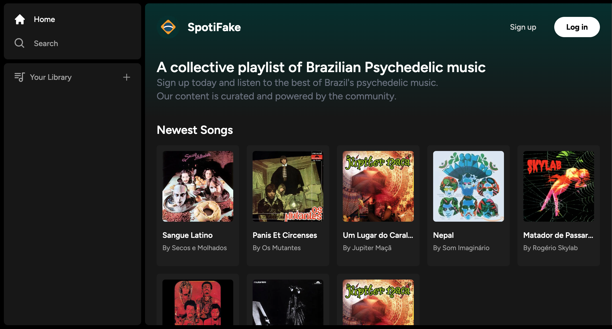
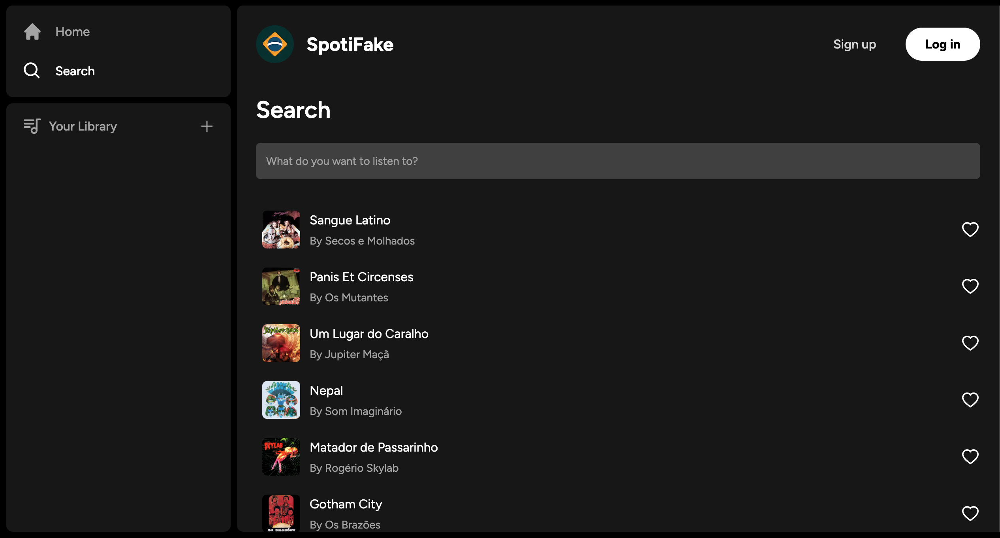
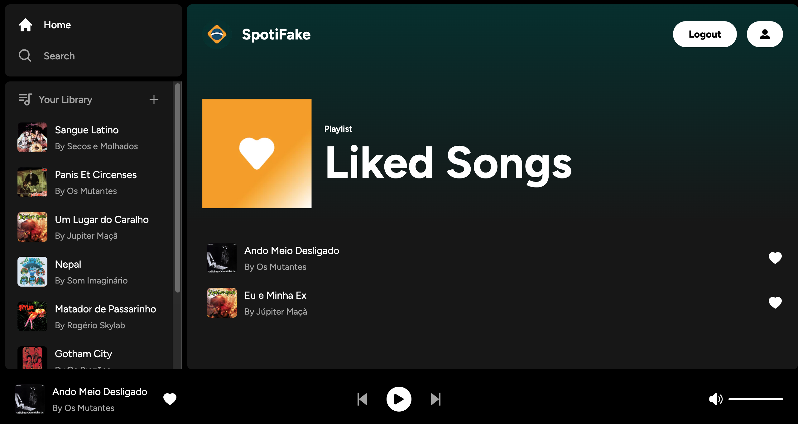

<a name="readme-top"></a>


# SpotiFake - a Full Stack Spotify Clone
A collective playlist of Brazilian Psychedelic music.
Sign up today and listen to the best of Brazil's psychedelic music. Our content is curated and powered by the community.

### [Live Website](https://sabrinabertol.github.io/spotify-clone/)
## Some Images:





## Table of Contents
- [Introduction](#introduction)
- [Features](#features)
- [Technologies Used](#technologies-used)
- [Installation](#installation)
- [Usage](#usage)
- [Contributing](#contributing)

## Introduction
*SpotiFake* is a full stack Spotify clone built with Next.js 13.4 App Router: React, Tailwind, Supabase and PostgreSQL and deployed in Vercel. 

## Features
- Tailwind animations and transition effects
- Full responsiveness for all devices
- Search songs
- Play audios
- Favorite songs
- Liked Songs playlist 
- File and image upload using Supabase storage
- Credential authentication with Supabase
- Github authentication integration


## Technologies Used
- Next.Js: A React framework that provides server-side rendering and static site generation for building web applications.
- React.js: A JavaScript library for building user interfaces.
- Supabase: An open source platform that provides database, authentication, file storage, APIs, and other backend services.
- TailwindCSS: A CSS framework for creating responsive and mobile-first designs.
- TypeScript: A type-based programming language for adding interactivity to web applications.
- HTML5 & CSS3: Markup and styling languages for building web pages.
- Vercel: A platform for deploying and scaling web applications and sites with minimal configuration.

## Installation
To run this project locally, follow these steps:

1. Get a free API Key in [Supabase](https://rapidapi.com/)
2. Clone the repository: `git clone https://sabrinabertol.github.io/spotify-clone.git`
3. Navigate to the project directory: `cd spotify-clone`
4. Enter your Supabase keys in the .env.local file: 
```
NEXT_PUBLIC_SUPABASE_URL=
NEXT_PUBLIC_SUPABASE_ANON_KEY=
SUPABASE_SERVICE_ROLE_KEY=
```
5. Install the dependencies: `npm install`
6. Use `database.sql` file, create songs and liked_songs table (you can check the [tutorial](https://www.codewithantonio.com/projects/music-platform) I followed to create this project)
7. Start the development server: `npm run dev`
8. Open your browser and visit: `http://localhost:3000`

## Usage
After installing and running the project locally, you can navigate through SpotiFake. Without authentication, you will be able to see the songs in our catalog and search for specific ones. To listen or favorite songs, you need to authenticate using either an e-mail or your github account. You will also be able to upload new songs, but our content is curated, so your uploads may be excluded from the platform if they don't follow it's purpose. 

## Contributing
Contributions are welcome! If you'd like to contribute to this project, please follow these steps:

1. Fork the repository.
2. Create a new branch for your feature or bug fix: `git checkout -b my-feature`
3. Commit your changes: `git commit -m 'Add some feature'`
4. Push to the branch: `git push origin my-feature`
5. Open a pull request.

## Acknowledgments

* [Full Stack Spotify Clone](https://www.codewithantonio.com/projects/music-platform) by CodeWithAntonio

<p align="right"><a href="#readme-top">back to top</a></p>